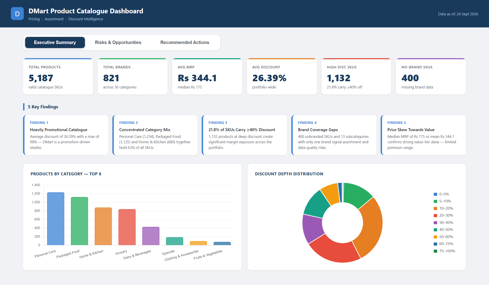
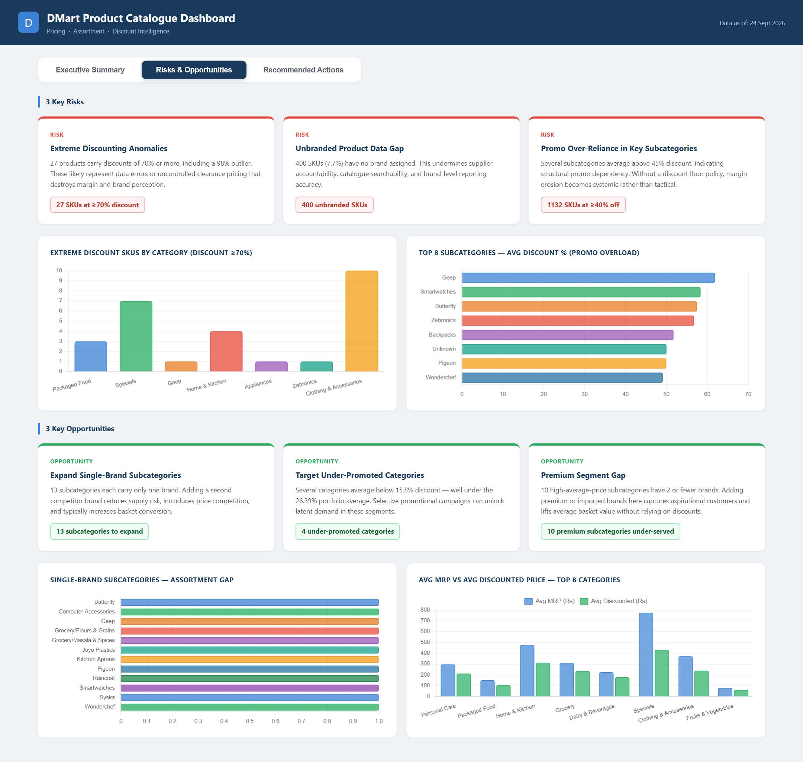
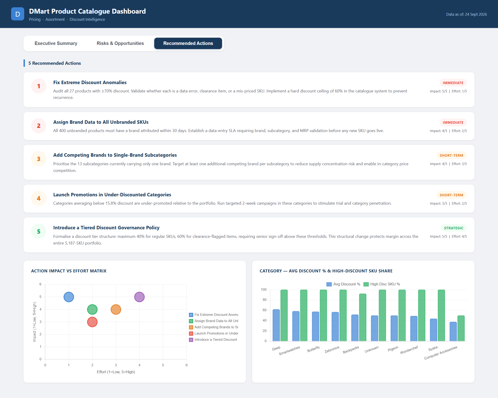

# DMart Product Catalogue Analysis

> **Pricing · Assortment · Discount Intelligence Dashboard**

A focused data analysis pipeline and interactive 3-tab decision dashboard built on DMart's product catalogue dataset (5,187 SKUs across 30 categories, 87 subcategories, and 821 brands).

---

## Dashboard Preview

### Page 1 — Executive Summary
KPI cards · 5 Key Findings · Category bar chart · Discount distribution doughnut



---

### Page 2 — Risks & Opportunities
3 Risk cards · Extreme discount chart · Promo overload chart · 3 Opportunity cards · Assortment gap chart · Price gap chart



---

### Page 3 — Recommended Actions
5 numbered action cards · Horizon labels (Immediate / Short-Term / Strategic) · Impact vs Effort bubble matrix · Category discount comparison chart



---

## Project Structure

```
Final_Project/
├── SauravSarwan_DMartPricing&Assortment.py   # Entry point — run this first
├── requirements.txt                           # pandas, numpy
├── DMart.csv                                  # Source dataset
├── README.md
├── SauravSarwan_DMartReport.docx              # 9-section report with embedded screenshots
│
├── backend/
│   └── analysis.py                            # 8-phase analysis engine
│
├── frontend/
│   └── dashboard.html                         # 3-tab interactive dashboard
│
└── outputs/                        # Auto-generated by running the main script
    ├── kpis.json
    ├── category_analysis.json
    ├── subcategory_analysis.json
    ├── brand_analysis.json
    ├── discount_distribution.json
    ├── price_distribution.json
    ├── anomalies.json
    ├── opportunities.json
    ├── top_products.json
    ├── screenshot_executive.png
    ├── screenshot_insights.png
    └── screenshot_actions.png
```

---

## Quick Start

```bash
# 1. Install dependencies
pip install -r requirements.txt

# 2. Run the analysis (generates all JSON outputs)
python "SauravSarwan_DMartPricing&Assortment.py"

# 3. Open the dashboard in any modern browser
#    → frontend/dashboard.html
```

> The dashboard reads `../outputs/*.json` via relative paths — keep the folder structure intact.

---

## Dashboard — 3 Tabs

| Tab | Contents | Purpose |
|-----|----------|---------|
| **Executive Summary** | 6 KPI cards, 5 Key Findings, 2 summary charts | Management snapshot |
| **Risks & Opportunities** | 3 risk cards + 3 opportunity cards with supporting charts | Decision intelligence |
| **Recommended Actions** | 5 numbered actions + Impact/Effort matrix | Action planning |

---

## 5 Key Findings

| # | Finding | Data Point |
|---|---------|-----------|
| 1 | Heavily Promotional Catalogue | Avg discount 26.39%, max 98% |
| 2 | Concentrated Category Mix | Personal Care + Packaged Food + Home & Kitchen = 63% of SKUs |
| 3 | 21.8% of SKUs Carry ≥40% Discount | 1,132 products — significant margin exposure |
| 4 | Brand Coverage Gaps | 400 unbranded SKUs + 13 single-brand subcategories |
| 5 | Price Skew Towards Value | Median Rs 175 vs mean Rs 344 — limited premium range |

---

## 3 Risks · 3 Opportunities · 5 Actions

**Risks**
1. Extreme Discounting Anomalies — 27 SKUs at ≥70% discount (max 98%)
2. Unbranded Product Data Gap — 400 SKUs with no brand (7.7%)
3. Promo Over-Reliance — 1,132 SKUs at ≥40% discount across subcategories

**Opportunities**
1. Expand Single-Brand Subcategories — 13 subcategories with only 1 brand
2. Target Under-Promoted Categories — 4 categories below 15.8% avg discount
3. Premium Segment Gap — 10 high-price subcategories with ≤2 brands

**Actions**

| # | Action | Horizon | Impact | Effort |
|---|--------|---------|--------|--------|
| 1 | Fix extreme discount anomalies | Immediate | 5/5 | 1/5 |
| 2 | Assign brand data to all 400 unbranded SKUs | Immediate | 4/5 | 2/5 |
| 3 | Add competing brands to 13 single-brand subcategories | Short-Term | 4/5 | 3/5 |
| 4 | Launch promotions in under-discounted categories | Short-Term | 3/5 | 2/5 |
| 5 | Introduce tiered discount governance policy | Strategic | 5/5 | 4/5 |

---

## Requirements

- Python 3.9+, pandas ≥ 2.0, numpy ≥ 1.24
- Any modern browser (Chrome, Firefox, Edge) for the dashboard
- Internet connection for Chart.js CDN (charts only)
